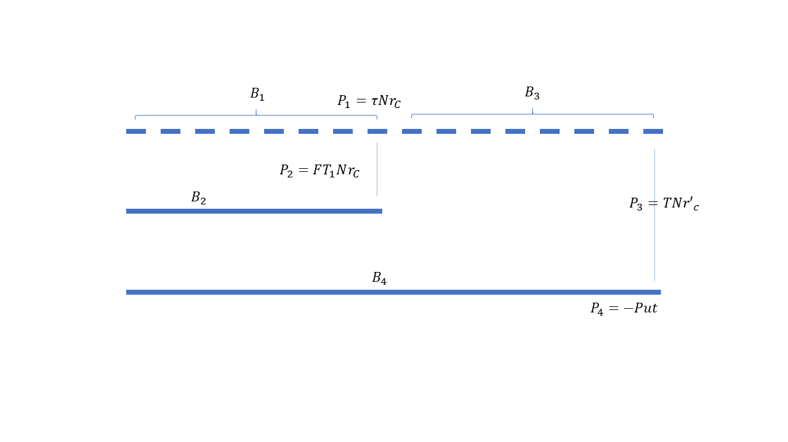

## 障碍期权通用数学表达方法介绍
障碍期权作为一大类常见的奇异期权，衍生出的奇异结构层出不穷，简单的单双障碍期权及其组合的方式已难以满足我们对这一类奇异结构的快速拆解与定价的需要。

障碍作为期权收益条款的前置条件，有一定的优先级别，比如在雪球期权中，首先要判断是否向上敲出，再判断是否向下敲入，如果利用伪代码来表达就是一系列嵌套的if-else 语句。考察这样一个期权结构：如果障碍事件$B_1$发生敲出（不论是向上还是向下，下同），则支付$P_1$, **否则** 如果障碍$B_2$ 不发生敲入，则支付$P_2$, **否则** 支付$P_3$。该条款用伪代码表达即为
```python
if B1 is hit:
    pay P1
    break
elif B2 is never hit:
    pay P2
    break
else:
    pay P3
    break
```
我们发明了一种数学表达方法，将上述if-else语句转换为一个数学表达式，并根据逻辑关系为该数学表达方法定义了一些基本运算，利用该表达方法与基本运算，我们可以快速准确地将各种复杂的障碍结构进行有效的拆解，从而达到数值定价的目的。

比如上面的伪代码，在该表达方法下，可以表示为：
$$B_1(P_1)\bar{B_2}(P_2)P_3$$
障碍上带横线的表示障碍不发生时支付括号里的收益结构，否则继续向右考察障碍条件或进行最终支付，可以用来表达敲入型障碍发生与否。
## 障碍期权通用数学表达的运算规律
### 类型转换运算
敲入敲出的类型转换
$$\bar{B}(P_2)P_1 = B[P_2-P_1] + P_1$$
注意：不带圆括号的障碍条件表示敲出支付0，方括号中的内容可以看作一个整体。

上述公式的含义是：一个敲入支付$P_1$,不敲入支付$P_2$的期权 等价于一个无条件支付$P_1$的期权加上一个不敲出(敲出支付0)则支付$P_2-P_1$的期权。该公式是对in-out 障碍期权关系的一个扩展。
### 结合律
前置的障碍条件可以任意结合，但不能交换
$$B_1(P_1)\bar{B_2}(P_2)B_3(P_3)P_4 = B_1(P_1)[\bar{B_2}(P_2)B_3(P_3)]P_4 = [B_1(P_1)\bar{B_2}(P_2)]B_3(P_3)P_4$$
上述公式自然成立的原因是结合的实质是对if-else语句加上$\{\}$而已。

### 分配律
$$B(P)[P_1\pm P_2] = B(P)P_1 \pm BP_2 = BP_1 + B(P)[\pm P_2] $$

分配律的实质是期权组合定价理论，其成立也是显而易见的。

## 利用障碍期权通用数学表达方法拆解雪球结构
之前我们利用In-Out 关系详细分析了如何拆解雪球结构，并进行利用积分迭代的方法对其进行了精准快速的数值定价。现在我们利用这一套数学表达方法对雪球结构进行重新拆解。

我们用$B_1$ 表示向上敲出障碍，$P_1$表示敲出时支付相应的票息，$B_2$表示向下敲入障碍，$P_2$表示红利票息，$P_3$则表示敲入到期后的赔付，那么雪球结构就可以表达为
$$B_1(P_1)\bar{B_2}(P_2)P_3$$
我们分别利用结合律，类型转换和分配律对上述表达式进行变形：
$$
\begin{aligned}
B_1(P_1)\bar{B_2}(P_2)P_3 &= B_1(p_1)[\bar{B_2}(P_2)P_3]\\
&=B_1(P_1)[B_2[P_2-P_3]+P_3]\\
&=B_1(P_1)B_2[P_2-P_3] + B_1P_3
\end{aligned}
$$
至此，雪球结构已拆解为两个敲出类型的障碍期权的组合。该结果与我们对雪球结构的拆解结果是相一致的。
## 利用障碍期权通用数学表达方法拆解壁虎型雪球结构
### 壁虎型雪球结构
关于壁虎型雪球结构条款的具体内容可以参考中信建投证券资产管理部微信公众号文章：[聊聊“壁虎型雪球”策略：兜起资产保值增值安全网](https://mp.weixin.qq.com/s/cn-bpnHFpfT9uf3YfLUm6A)
文章中提到的壁虎型雪球结构有两次避险机制，简单起见，我们以只有一次避险机会的壁虎型雪球结构为例。

如上图所示，我们用B代表障碍结构，P代表支付结构。比如$B_1$代表在避险观察日之前的向上敲出障碍，$B_2$代表避险事件界限，$P_1$代表向上敲出时的票息收益，等等，不一一描述。

### 期初估值

根据壁虎型雪球结构条款，我们可以将其转换为如下的伪代码
```python
if B1 is hit:
    pay P1
    break
elif B2 is never hit:
    pay P2
    break
elif B3 is hit :
    pay P1
    break
elif B4 is never hit:
    pay P3
    break
else:
    pay P4
    break
```

根据上述伪代码可以将壁虎型雪球结构用障碍期权通用数学描述语言表达为：
$$B_1(P_1)\bar{B_2}(P_2)B_3(P_1)\bar{B_4}(P_3)P_4 \tag{1}$$

表达式包含敲入类型的障碍，下面就通过类型转换与分配结合律将壁虎型雪球结构拆解为可数值定价的纯敲出类型障碍期权组合。

根据敲入敲出障碍类型转换关系：$\bar{B_4}(P_3)P_4 = B_4[P_3 -P_4] + P_4$

于是有：
$$
\begin{aligned}
B_3(P_1)\bar{B_4}(P_3)P_4 &=B_3(P_1)[ B_4[P_3 -P_4] + P_4]\\
&=B_3(P_1)B_4[P_3 -P_4] + B_3P_4
\end{aligned}
$$

设$A =B_3(P_1)B_4[P_3 -P_4] + B_3P_4$, 

于是有：
$$
\begin{aligned}
\bar{B_2}(P_2)[B_3(P_1)\bar{B_4}(p_3)P_4] &=\bar{B_2}(P_2)A\\
&= B_2[P_2-A] + A \\
&= B_2P_2 - B_2A + A\\
&= B_2P_2 - B_2[B_3(P_1)B_4[P_3 -P_4] + B_3P_4] +B_3(P_1)B_4[P_3 -P_4] + B_3P_4 \\
& = B_2P_2 - B_2B_3(P_1)B_4[P_3 -P_4] - B_2B_3P_4 + B_3(P_1)B_4[P_3 -P_4] + B_3P_4
\end{aligned}
$$
最后再前缀叠加$B_1(P_1)$的条件，于是有：
$$
\begin{aligned}
B_1(P_1)\bar{B_2}(P_2)B_3(P_1)\bar{B_4}(P_3)P_4 &= B_1(P_1)[\bar{B_2}(P_2)B_3(P_1)\bar{B_4}(P_3)P_4] \\ 
&=B_1(P_1)[B_2P_2 - B_2B_3(P_1)B_4[P_3 -P_4] - B_2B_3P_4 + B_3(P_1)B_4[P_3 -P_4] + B_3P_4]\\
&=B_1(P_1)B_2P_2 - B_1B_2B_3(P_1)B_4[P_3 -P_4] - B_1B_2B_3P_4  + B_1B_3(P_1)B_4[P_3 -P_4] + B_1B_3P_4
\end{aligned}
$$

注意到$B_1B_3P_4$ 就是以原雪球结构的向上敲出障碍为障碍的向上敲出障碍期权，我们将其简写为$B_0P_4$,至此，壁虎型雪球结构的拆分完成：

- a: $B_0P_4$
- b: $B_1(P_1)B_2P_2$ 
- c: $B_1B_2B_3P_4$
- d: $B_1B_3(P_1)B_4[P_3 -P_4]$
- e: $B_1B_2B_3(P_1)B_4[P_3 -P_4]$

### 避险事件未能触发后估值

在壁虎型雪球产品的存续过程中，如果$B_2$ 障碍发生敲入，避险条件即失效，反映在式$(1)$中即简单地去除掉$\bar{B_2}(P_2)$这一项即可

$$B_0(P_1)\bar{B_4}(P_3)P_4 \tag{2}$$

即转换成为一个标准雪球，后续的情景讨论不再赘述。


